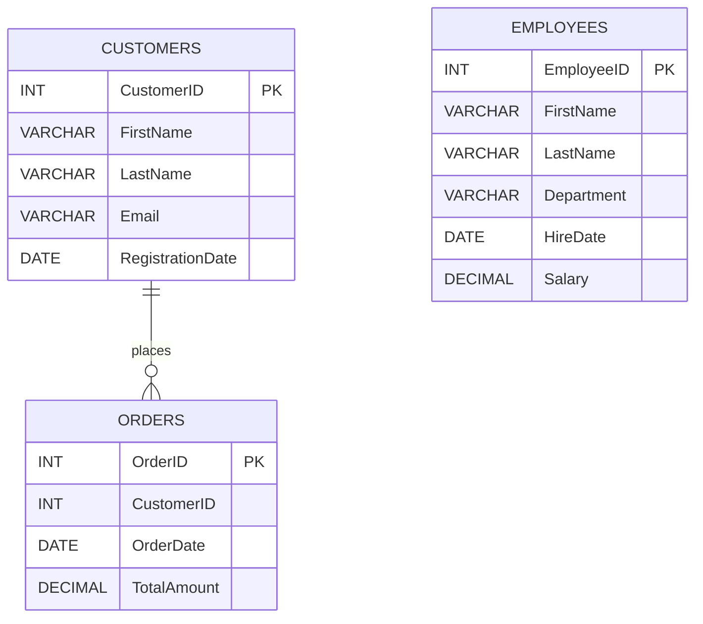

# 🚀 Data Transformer SQL Lab

A practical MySQL project demonstrating database creation, table relationships, joins, subqueries, date functions, string transformations, window functions, and conditional logic.

> **Database:** `data_transformer`  
> **SQL Dialect:** MySQL 8.0+  
> **Author:** KARTAVYA Patel


---

## 📌 Project Overview

This project contains three related tables:

- `Customers` — stores customer details.
- `Orders` — stores order information.
- `Employees` — stores employee and salary information.

The SQL file demonstrates common data transformation and analysis techniques used in real-world databases.

## ✨ Features Demonstrated

- Database and table creation.
- Insertion of sample records.
- `INNER JOIN`, `LEFT JOIN`, and `RIGHT JOIN`.
- Simulated `FULL OUTER JOIN` using `UNION`.
- Subqueries with `AVG()`.
- Date extraction using `YEAR()` and `MONTH()`.
- Date difference calculation using `DATEDIFF()`.
- Date formatting using `DATE_FORMAT()`.
- String concatenation, replacement, trimming, and case conversion.
- Running totals using window functions.
- Order ranking using `RANK()`.
- Discounts and salary categories using `CASE`.

## 🗂️ Database Schema

```text
data_transformer
├── Customers
│   ├── CustomerID PRIMARY KEY
│   ├── FirstName
│   ├── LastName
│   ├── Email
│   └── RegistrationDate
│
├── Orders
│   ├── OrderID PRIMARY KEY
│   ├── CustomerID
│   ├── OrderDate
│   └── TotalAmount
│
└── Employees
    ├── EmployeeID PRIMARY KEY
    ├── FirstName
    ├── LastName
    ├── Department
    ├── HireDate
    └── Salary
```

## 🔗 Entity Relationship Diagram



## ⚙️ How to Run

1. Install MySQL 8.0 or later.
2. Open MySQL Workbench, phpMyAdmin, or MySQL Command Line.
3. Open the SQL file.
4. Execute the SQL statements from top to bottom.

```sql
CREATE DATABASE data_transformer;
USE data_transformer;
```

If the SQL file is saved locally, you can run it using:

```sql
SOURCE path/to/data_transformer.sql;
```

## 📊 Sample Data Summary

### Customers

| CustomerID | Name | Registration Date |
|---:|---|---|
| 1 | John Doe | 2022-03-15 |
| 2 | Jane Smith | 2021-11-02 |
| 3 | Robert Brown | 2023-01-10 |
| 4 | Emily Davis | 2022-08-22 |
| 5 | Michael Wilson | 2023-05-30 |
| 6 | Sarah Taylor | 2021-06-18 |

### Orders

| OrderID | CustomerID | Order Date | Total Amount |
|---:|---:|---|---:|
| 101 | 1 | 2023-07-01 | 150.50 |
| 102 | 2 | 2023-07-03 | 200.75 |
| 103 | 1 | 2023-07-10 | 1200.00 |
| 104 | 3 | 2023-07-15 | 600.00 |
| 105 | 4 | 2023-08-02 | 75.25 |
| 106 | 2 | 2023-08-05 | 950.00 |
| 107 | 99 | 2023-08-10 | 300.00 |

### Employees

| EmployeeID | Employee | Department | Hire Date | Salary |
|---:|---|---|---|---:|
| 1 | Mark Johnson | Sales | 2020-01-15 | 50000.00 |
| 2 | Susan Lee | HR | 2021-03-20 | 55000.00 |
| 3 | David Martinez | IT | 2019-07-11 | 72000.00 |
| 4 | Linda Garcia | Sales | 2022-02-28 | 42000.00 |
| 5 | James Anderson | Finance | 2020-11-05 | 61000.00 |

## 🔍 Query Results

### 1. Inner Join

The `INNER JOIN` returns only orders with a matching customer.

**Expected result: 6 rows**

| OrderID | OrderDate | TotalAmount | CustomerID | Customer |
|---:|---|---:|---:|---|
| 101 | 2023-07-01 | 150.50 | 1 | John Doe |
| 102 | 2023-07-03 | 200.75 | 2 | Jane Smith |
| 103 | 2023-07-10 | 1200.00 | 1 | John Doe |
| 104 | 2023-07-15 | 600.00 | 3 | Robert Brown |
| 105 | 2023-08-02 | 75.25 | 4 | Emily Davis |
| 106 | 2023-08-05 | 950.00 | 2 | Jane Smith |

Order `107` is excluded because `CustomerID = 99` does not exist in the `Customers` table.

### 2. Left Join

The `LEFT JOIN` returns every customer, including customers who do not have any orders.

**Expected result: 8 rows**

| CustomerID | Customer | OrderID | OrderDate | TotalAmount |
|---:|---|---:|---|---:|
| 1 | John Doe | 101 | 2023-07-01 | 150.50 |
| 1 | John Doe | 103 | 2023-07-10 | 1200.00 |
| 2 | Jane Smith | 102 | 2023-07-03 | 200.75 |
| 2 | Jane Smith | 106 | 2023-08-05 | 950.00 |
| 3 | Robert Brown | 104 | 2023-07-15 | 600.00 |
| 4 | Emily Davis | 105 | 2023-08-02 | 75.25 |
| 5 | Michael Wilson | NULL | NULL | NULL |
| 6 | Sarah Taylor | NULL | NULL | NULL |

Michael Wilson and Sarah Taylor appear because they have no matching orders.

### 3. Right Join

The `RIGHT JOIN` returns every order, including orders without matching customers.

**Expected result: 7 rows**

| OrderID | OrderDate | TotalAmount | CustomerID | Customer |
|---:|---|---:|---:|---|
| 101 | 2023-07-01 | 150.50 | 1 | John Doe |
| 102 | 2023-07-03 | 200.75 | 2 | Jane Smith |
| 103 | 2023-07-10 | 1200.00 | 1 | John Doe |
| 104 | 2023-07-15 | 600.00 | 3 | Robert Brown |
| 105 | 2023-08-02 | 75.25 | 4 | Emily Davis |
| 106 | 2023-08-05 | 950.00 | 2 | Jane Smith |
| 107 | 2023-08-10 | 300.00 | NULL | NULL |

Order `107` remains visible because the query preserves all rows from `Orders`.

### 4. Full Outer Join Simulation

MySQL does not directly support `FULL OUTER JOIN`.

The following method combines a `LEFT JOIN` and a `RIGHT JOIN`:

```sql
SELECT ...
FROM Customers AS c
LEFT JOIN Orders AS o
    ON c.CustomerID = o.CustomerID

UNION

SELECT ...
FROM Customers AS c
RIGHT JOIN Orders AS o
    ON c.CustomerID = o.CustomerID;
```

**Expected result: 9 rows**

The output includes:

- Six matched customer-order records.
- Two customers without orders.
- One order without a matching customer.

`UNION` removes duplicate rows. Use `UNION ALL` if duplicate rows should be preserved.

### 5. Customers with Above-Average Orders

The average order amount is:

```text
496.64
```

| CustomerID | Customer | Qualifying Order Amount |
|---:|---|---:|
| 1 | John Doe | 1200.00 |
| 2 | Jane Smith | 950.00 |
| 3 | Robert Brown | 600.00 |

The `DISTINCT` keyword ensures that each customer appears only once.

### 6. Employees Above Average Salary

The average employee salary is:

```text
56000.00
```

| EmployeeID | Employee | Salary |
|---:|---|---:|
| 3 | David Martinez | 72000.00 |
| 5 | James Anderson | 61000.00 |

### 7. Date Extraction

The query extracts the year and month from every order date.

| OrderID | OrderDate | OrderYear | OrderMonth |
|---:|---|---:|---:|
| 101 | 2023-07-01 | 2023 | 7 |
| 102 | 2023-07-03 | 2023 | 7 |
| 103 | 2023-07-10 | 2023 | 7 |
| 104 | 2023-07-15 | 2023 | 7 |
| 105 | 2023-08-02 | 2023 | 8 |
| 106 | 2023-08-05 | 2023 | 8 |
| 107 | 2023-08-10 | 2023 | 8 |

### 8. Days Since Order

```sql
DATEDIFF(CURDATE(), OrderDate)
```

This calculates how many days have passed since each order was placed.

The output changes depending on the date when the query is executed.

### 9. Formatted Dates

```sql
DATE_FORMAT(OrderDate, '%d-%b-%Y')
```

Expected output:

| OrderID | FormattedDate |
|---:|---|
| 101 | 01-Jul-2023 |
| 102 | 03-Jul-2023 |
| 103 | 10-Jul-2023 |
| 104 | 15-Jul-2023 |
| 105 | 02-Aug-2023 |
| 106 | 05-Aug-2023 |
| 107 | 10-Aug-2023 |

### 10. Full Customer Names

```sql
CONCAT(FirstName, ' ', LastName)
```

Example output:

| CustomerID | FullName |
|---:|---|
| 1 | John Doe |
| 2 | Jane Smith |
| 3 | Robert Brown |
| 4 | Emily Davis |
| 5 | Michael Wilson |
| 6 | Sarah Taylor |

### 11. Name Replacement

```sql
REPLACE(FirstName, 'John', 'Jonathan')
```

Expected output:

| CustomerID | FirstName | UpdatedName |
|---:|---|---|
| 1 | John | Jonathan |
| 2 | Jane | Jane |
| 3 | Robert | Robert |
| 4 | Emily | Emily |
| 5 | Michael | Michael |
| 6 | Sarah | Sarah |

### 12. Uppercase and Lowercase Conversion

| CustomerID | FirstNameUpper | LastNameLower |
|---:|---|---|
| 1 | JOHN | doe |
| 2 | JANE | smith |
| 3 | ROBERT | brown |
| 4 | EMILY | davis |
| 5 | MICHAEL | wilson |
| 6 | SARAH | taylor |

### 13. Email Cleaning

```sql
TRIM(Email)
```

The `TRIM()` function removes spaces before and after an email address.

The current email values do not contain extra spaces, so the visible output remains unchanged.

### 14. Running Total

The running total is calculated in order of `OrderDate`.

| OrderID | TotalAmount | RunningTotal |
|---:|---:|---:|
| 101 | 150.50 | 150.50 |
| 102 | 200.75 | 351.25 |
| 103 | 1200.00 | 1551.25 |
| 104 | 600.00 | 2151.25 |
| 105 | 75.25 | 2226.50 |
| 106 | 950.00 | 3176.50 |
| 107 | 300.00 | 3476.50 |

### 15. Order Ranking

Orders are ranked from the highest total amount to the lowest.

| Rank | OrderID | TotalAmount |
|---:|---:|---:|
| 1 | 103 | 1200.00 |
| 2 | 106 | 950.00 |
| 3 | 104 | 600.00 |
| 4 | 107 | 300.00 |
| 5 | 102 | 200.75 |
| 6 | 101 | 150.50 |
| 7 | 105 | 75.25 |

### 16. Discount Calculation

| OrderID | TotalAmount | Discount | AmountAfterDiscount |
|---:|---:|---|---:|
| 101 | 150.50 | No discount | 150.50 |
| 102 | 200.75 | No discount | 200.75 |
| 103 | 1200.00 | 10% off | 1080.00 |
| 104 | 600.00 | 5% off | 570.00 |
| 105 | 75.25 | No discount | 75.25 |
| 106 | 950.00 | 5% off | 902.50 |
| 107 | 300.00 | No discount | 300.00 |

Discount rules:

```text
Amount > 1000  → 10% discount
Amount > 500   → 5% discount
Otherwise      → No discount
```

### 17. Employee Salary Categories

| EmployeeID | Employee | Salary | Category |
|---:|---|---:|---|
| 1 | Mark Johnson | 50000.00 | Medium |
| 2 | Susan Lee | 55000.00 | Medium |
| 3 | David Martinez | 72000.00 | High |
| 4 | Linda Garcia | 42000.00 | Low |
| 5 | James Anderson | 61000.00 | High |

Salary rules:

```text
Salary >= 60000  → High
Salary >= 45000  → Medium
Otherwise        → Low
```

## 🧪 Data Quality Demonstrations

| Scenario | Record | Purpose |
|---|---|---|
| Customer without orders | Michael Wilson | Demonstrates `LEFT JOIN` |
| Customer without orders | Sarah Taylor | Demonstrates `LEFT JOIN` |
| Order without customer | Order 107 | Demonstrates `RIGHT JOIN` |
| Above-average order | Order 103 | Demonstrates subqueries |
| High-value order | Order 103 | Demonstrates discount logic |

## 🔐 Recommended Foreign Key

The current database allows an order to reference a customer that does not exist.

For a production database, add a foreign key:

```sql
ALTER TABLE Orders
ADD CONSTRAINT fk_orders_customer
FOREIGN KEY (CustomerID)
REFERENCES Customers(CustomerID);
```

Before adding the foreign key, correct or remove the invalid order:

```sql
DELETE FROM Orders
WHERE OrderID = 107;
```

## ✅ Improved Running Total Query

For reliable ordering when two orders have the same date, include both `OrderDate` and `OrderID`.

```sql
SELECT
    OrderID,
    CustomerID,
    OrderDate,
    TotalAmount,
    SUM(TotalAmount) OVER (
        ORDER BY OrderDate, OrderID
        ROWS BETWEEN UNBOUNDED PRECEDING AND CURRENT ROW
    ) AS RunningTotal
FROM Orders;
```

## 📁 Suggested Repository Structure

```text
data-transformer/
├── README.md
├── data_transformer.sql
├── screenshots/
│   ├── inner-join.png
│   ├── left-join.png
│   ├── running-total.png
│   └── salary-categories.png
└── LICENSE
```

## 🎯 Learning Outcomes

After completing this project, you should be able to:

- Create and populate a relational database.
- Understand different SQL join types.
- Identify unmatched records.
- Use subqueries for data analysis.
- Transform date and text values.
- Apply business rules using `CASE`.
- Calculate running totals and rankings.
- Improve database reliability using foreign keys.

## 🛠️ Technologies Used

- MySQL
- SQL
- MySQL Workbench
- GitHub Markdown
- Mermaid ER Diagrams

## 📜 License

This project is created for educational and learning purposes.

You are free to modify and extend it for your SQL practice portfolio.

---

⭐ If you found this project useful, consider giving the repository a star!
